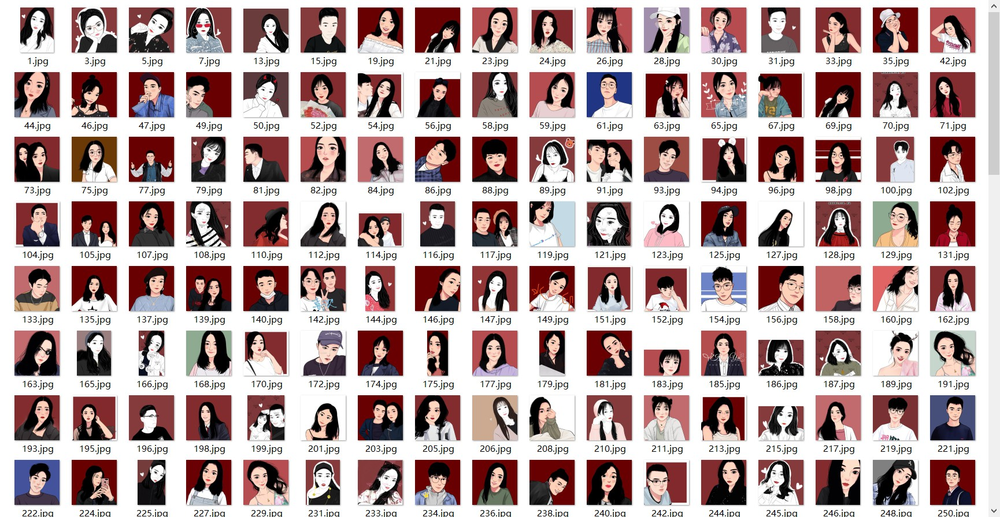
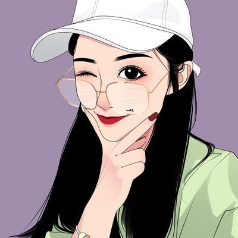
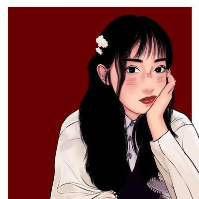
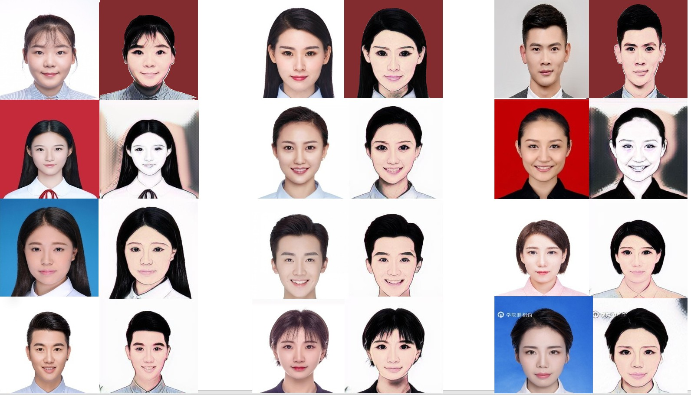
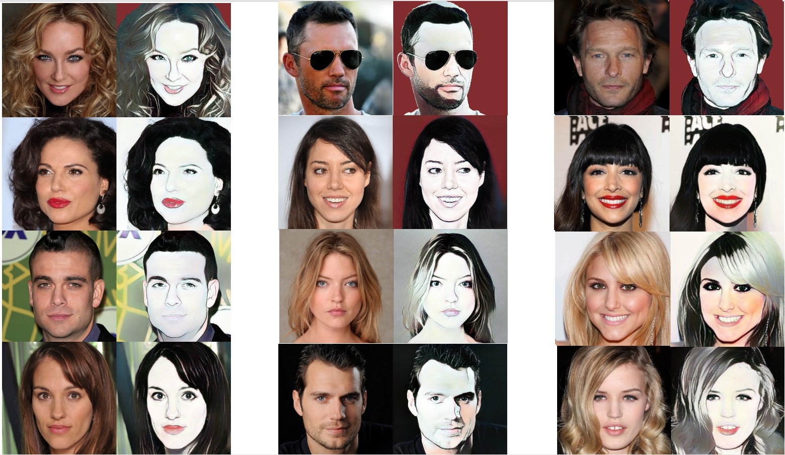

# selfie-Cartoonization-GAN

This is our project which can convert a selfie to a hand-painted cartoon image by GAN. This work is motivated by CartoonGAN.  However, CartoonGAN cannot avoid the influence of background if background doesn’t belong to style. We add a segmentation network(Unet) to solve the problem. More information can be seen in the [slide](<https://github.com/yifan123/selfie-Cartoonization-GAN/blob/master/selfie-Cartoonization-GAN.pdf>).

We build two new datasets 

- a hand-painted cartoon image dataset;

  

  

  

  

- an identification photo dataset.

The following are sources of training image

- Baidu image

- Google image

- Taobao comments

The following are dataset information.

| **Selfie**           | **Numbers** |
| -------------------- | ----------- |
| celebA               | 350         |
| identification photo | 340         |

| **Style**    | **Numers** |
| ------------ | ---------- |
| Hand-painted | 311        |

If you need hand-painted to do research, welcome to email me. I can not upload it to github because the hand-painted images are crawled from customer comments of Taobao stores. I didn't get their  authorization.

The following are our results.

 

You may see that the background of the 1st row is red. To make it more interesting, I changed the background of the 1st row to red color by photoshop. However, others are indeed directly generated by our model.